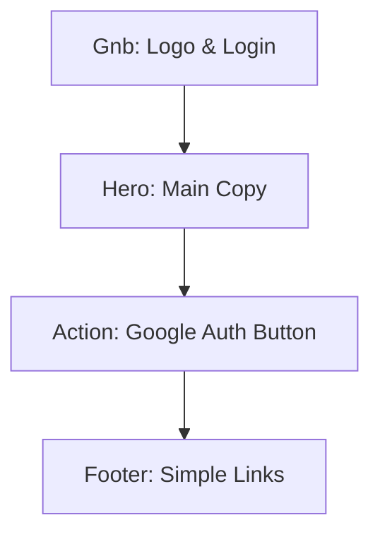
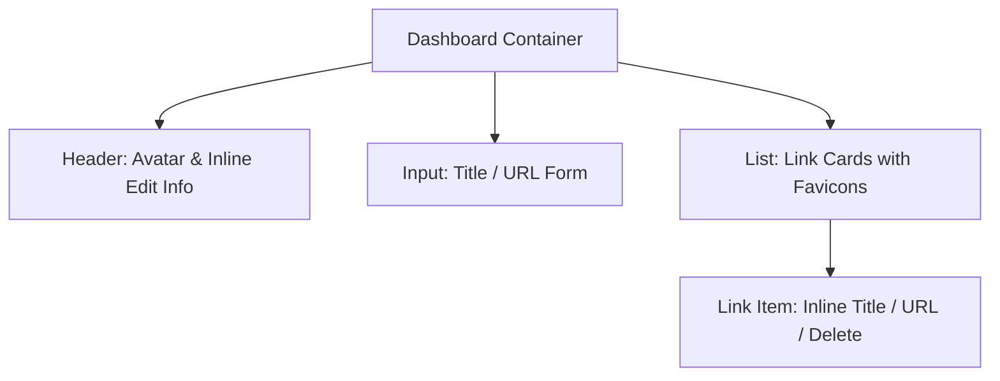
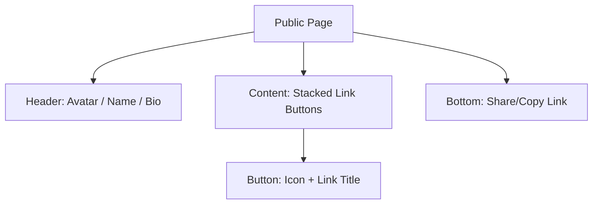

# 🖼️ 마이링크 (MyLink) 와이어프레임 기획

본 문서는 마이링크의 주요 페이지 레이아웃과 컴포넌트 구성을 정의합니다. 디자인 컨셉은 **네오브루탈리즘(Neobrutalism)** 스타일을 따릅니다.

---

## 1. 랜딩 페이지 (Landing Page)
서비스의 첫인상을 결정하는 페이지로, 명확한 가치 제안과 구글 로그인 버튼이 중심입니다.

### [ASCII Layout]
```text
+-------------------------------------------------------+
|  MyLink                                [Login Button] |
+-------------------------------------------------------+
|                                                       |
|        [ Catchy Main Heading : 링크 하나로 ]          |
|        [ Your Identity in One Link         ]          |
|                                                       |
|             +--------------------------+              |
|             |  [G] Google로 3초만에 가입  | <--- High Contrast
|             +--------------------------+              |
|                                                       |
|        +-----------------------------------+          |
|        |   [ Illustration of Profile ]     |          |
|        +-----------------------------------+          |
|                                                       |
+-------------------------------------------------------+
```

### [Mermaid Structure]


---

## 2. 관리자 대시보드 (Admin Dashboard)
로그인 후 자신의 정보를 수정하고 링크를 관리하는 핵심 공간입니다. 모든 요소는 **인라인 편집**이 가능합니다.

### [ASCII Layout]
```text
+-------------------------------------------------------+
|  MyLink Dashboard                     [Logout] [Share]|
+-------------------------------------------------------+
|                                                       |
|          [ (A) Avatar ]  <--- First Letter Icon       |
|          [ Username ]    <--- Click to edit Name      |
|          [   Bio    ]    <--- Click to edit Bio       |
|          [ Slug URL ]    <--- mylink.site/[Slug] (Edit)|
|                                                       |
|  +-------------------------------------------------+  |
|  | [+] 새 링크 추가                                 |  |
|  | [ Title ]   [ URL ]              [Add Button]   |  |
|  +-------------------------------------------------+  |
|                                                       |
|  [ Links List ]                                       |
|  +-------------------------------------------------+  |
|  | (Icon) [ Title ] <Edit>        [ URL ] <Edit> [X] |  | <-- Neobrutalism
|  +-------------------------------------------------+  |     Style Card
|  | (Icon) [ Title ] <Edit>        [ URL ] <Edit> [X] |  |
|  +-------------------------------------------------+  |
|                                                       |
+-------------------------------------------------------+
```

### [Mermaid Structure]


---

## 3. 공개 프로필 페이지 (Public Profile)
최종 방문자에게 노출되는 페이지입니다. 모바일 최적화된 심플한 카드 형태입니다.

### [ASCII Layout]
```text
+-------------------------------------+
|                                     |
|           [ (A) Avatar ]            |
|           [ Username   ]            |
|           [    Bio     ]            |
|                                     |
|     +-------------------------+     |
|     | (I)  GitHub Link        |     |
|     +-------------------------+     |
|                                     |
|     +-------------------------+     |
|     | (I)  Tech Blog          |     |
|     +-------------------------+     |
|                                     |
|     +-------------------------+     |
|     | (I)  Twitter(X)         |     |
|     +-------------------------+     |
|                                     |
|         [ Copy Link Button ]        |
|                                     |
+-------------------------------------+
```

### [Mermaid Structure]


---

## 🎨 디자인 핵심 포인트 (Neobrutalism)
컴포넌트 구현 시 다음 디자인 원칙을 적용합니다:
*   **Border:** 모든 카드와 버튼에는 `3px~4px` 두께의 선명한 검정색(`black`) 테두리를 적용합니다.
*   **Shadow:** 흐릿한 그림자가 아닌, 각진 형태의 불투명한 검정색 그림자(`Hard Shadow`)를 오른쪽 하단에 배치합니다.
*   **Color:** `#FFD100`(Yellow), `#FF5C00`(Orange), `#00F0FF`(Cyan) 등 채도 높은 원색을 포인트 컬러로 사용합니다.
*   **Animation:** 호버 시 또는 클릭 시 버튼이 그림자 방향으로 이동하여 실제로 눌리는 듯한 입체감을 줍니다.
