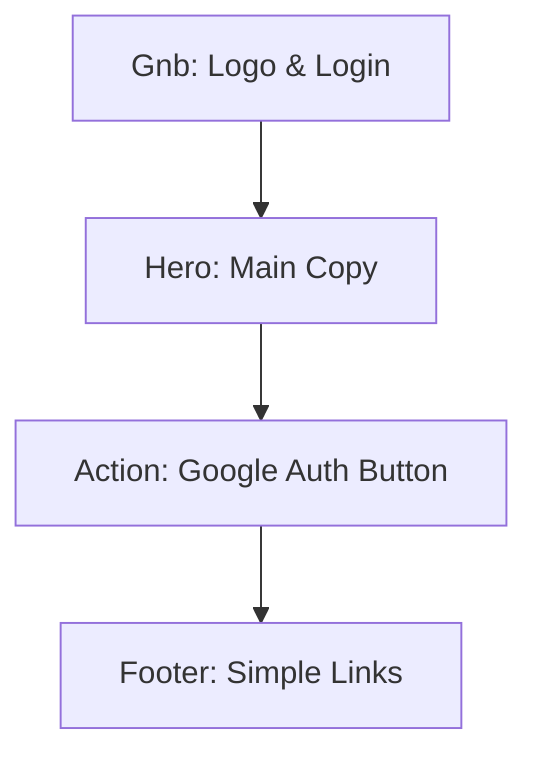
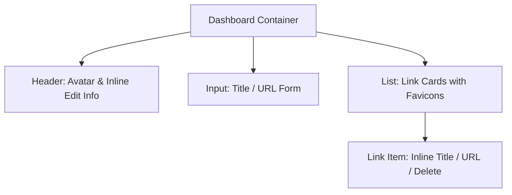
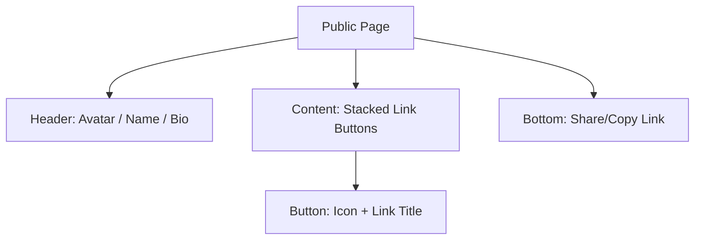

# 🖼️ MyLink Wireframe Planning

This document defines the layout and component structure for MyLink. The design concept follows the **Neobrutalism** style.

---

## 1. Landing Page
The first impression of the service, featuring a clear value proposition and a central Google login button.

### [ASCII Layout]
```text
+-------------------------------------------------------+
|  MyLink                                [Login Button] |
+-------------------------------------------------------+
|                                                       |
|        [ Catchy Main Heading : All in One ]           |
|        [ Your Identity in One Link        ]           |
|                                                       |
|             +--------------------------+              |
|             |  [G] Start with Google     | <--- High Contrast
|             +--------------------------+              |
|                                                       |
|        +-----------------------------------+          |
|        |   [ Illustration of Profile ]     |          |
|        +-----------------------------------+          |
|                                                       |
+-------------------------------------------------------+
```

### [Mermaid Structure]


---

## 2. Admin Dashboard
A space to edit info and manage links after logging in. All elements are **Inline Editable**.

### [ASCII Layout]
```text
+-------------------------------------------------------+
|  MyLink Dashboard                     [Logout] [Share]|
+-------------------------------------------------------+
|                                                       |
|          [ (A) Avatar ]  <--- First Letter Icon       |
|          [ Username ]    <--- Click to edit Name      |
|          [   Bio    ]    <--- Click to edit Bio       |
|          [ Slug URL ]    <--- mylink.site/[Slug] (Edit)|
|                                                       |
|  +-------------------------------------------------+  |
|  | [+] Add New Link                                 |  |
|  | [ Title ]   [ URL ]              [Add Button]   |  |
|  +-------------------------------------------------+  |
|                                                       |
|  [ Links List ]                                       |
|  +-------------------------------------------------+  |
|  | (Icon) [ Title ] <Edit>        [ URL ] <Edit> [X] |  | <-- Neobrutalism
|  +-------------------------------------------------+  |     Style Card
|  | (Icon) [ Title ] <Edit>        [ URL ] <Edit> [X] |  |
|  +-------------------------------------------------+  |
|                                                       |
+-------------------------------------------------------+
```

### [Mermaid Structure]


---

## 3. Public Profile Page
The final page exposed to visitors. Simple card-based layout optimized for mobile.

### [ASCII Layout]
```text
+-------------------------------------+
|                                     |
|           [ (A) Avatar ]            |
|           [ Username   ]            |
|           [    Bio     ]            |
|                                     |
|     +-------------------------+     |
|     | (I)  GitHub Link        |     |
|     +-------------------------+     |
|                                     |
|     +-------------------------+     |
|     | (I)  Tech Blog          |     |
|     +-------------------------+     |
|                                     |
|     +-------------------------+     |
|     | (I)  Twitter(X)         |     |
|     +-------------------------+     |
|                                     |
|         [ Copy Link Button ]        |
|                                     |
+-------------------------------------+
```

### [Mermaid Structure]


---

## 🎨 Design Key Points (Neobrutalism)
Apply the following design principles:
*   **Border:** Use `3px~4px` thick black (`black`) borders for all cards and buttons.
*   **Shadow:** Use angles `Hard Shadows` on the bottom right instead of blurry shadows.
*   **Color:** Use high-saturation colors like `#FFD100` (Yellow), `#FF5C00` (Orange), `#00F0FF` (Cyan) as point colors.
*   **Animation:** Move buttons towards the shadow on hover or click for a "pushed" 3D feel.
